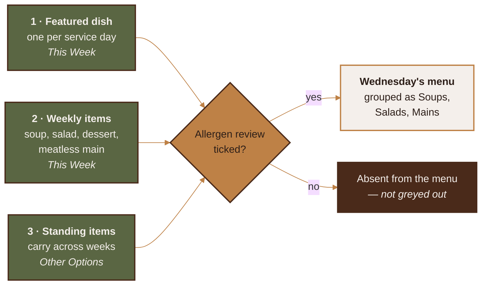
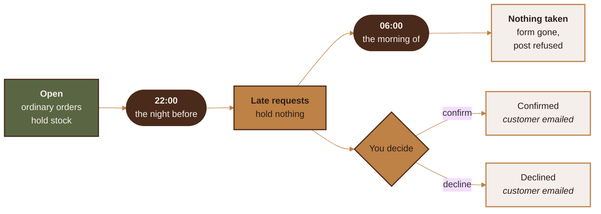

<p align="center">
  
</p>

<p align="center">
  
  
  
  
  
  
</p>

An installable web app for taking supper-club orders. Customers open a link,
pick a day, order, and choose pickup or delivery. You run the week from a phone.

There is no app store, no customer accounts, and no online payment. It is a
website that installs to a home screen and works like an app.

> [!TIP]
> **New here? Three commands and you're serving.** `npm install`, fill in
> `.env`, `npm start`. Everything else in this file is detail you can come
> back for.

---

## Contents

- 🔥 [Running it](#running-it)
- 🔑 [Environment variables](#environment-variables)
- 🍲 [The three-level menu](#the-three-level-menu)
- 📅 [Publishing a week](#publishing-a-week)
- 🚫 [Closing a day, or a week](#closing-a-day-or-a-week)
- ⏰ [The cutoff](#the-cutoff)
- 🚪 [Pickup window and locations](#pickup-window-and-locations)
- 🚗 [Delivery area](#delivery-area)
- ⚠️ [Allergens](#allergens)
- ✏️ [Spelling and grammar](#spelling-and-grammar)
- 💵 [Payment instructions](#payment-instructions)
- 🎨 [Colours and the theme file](#colours-and-the-theme-file)
- 📱 [Icons](#icons)
- 📣 [Social graphics](#social-graphics)
- 💳 [Business card](#business-card)
- 🏷️ [Sticker](#sticker)
- ✨ [README artwork](#readme-artwork)
- 👍 [Facebook](#facebook)
- 💾 [Backup and restore](#backup-and-restore)
- 🚀 [Deployment](#deployment)
- ✅ [Tests](#tests)
- 📦 [Dependencies](#dependencies)

---

## Running it

Node 20 or newer.

```bash
npm install
cp .env.example .env      # then fill it in — see below
npm run icons             # generates the app icons from brand/
npm start
```

The customer site is at `/`. Your dashboard is at `/admin`.

`npm run dev` restarts on file changes.

---

## Environment variables

Everything lives in `.env`. Copy `.env.example` and fill it in. Restart after
any change — nothing in this file is read again while the app is running.

| Variable | Required | What it does |
|---|---|---|
| `ADMIN_PASSWORD_HASH` | **Yes**, or the one below | The password for `/admin`, stored hashed. Run `npm run password`, paste the line it prints, delete `ADMIN_PASSWORD`. |
| `ADMIN_PASSWORD` | Only without the hash | The same password in the clear. Works, but anyone who reads the file has the dashboard — a backup, a screen share, a copy on the wrong laptop. |
| `SESSION_SECRET` | **Yes** | Signs your login cookie, together with the password. Changing either signs you out everywhere. |
| `PORT` | No | Defaults to 3000. |
| `BASE_URL` | Recommended | The public https address, no trailing slash. Used in emails, share links, the Facebook post, and the OAuth redirect. Must match exactly. An `https://` address is also what turns on secure cookies. |
| `TRUST_PROXY` | Behind nginx | Set to `1` when a proxy is in front, so the app reads the real visitor address. Leave unset when it isn't — see below. |
| `DB_PATH` | No | SQLite file. Defaults to `./data/dinnerbyderek.db`. |
| `UPLOAD_DIR` | No | Photo storage. Defaults to `./data/uploads`. |
| `GRAPHICS_DIR` | No | Generated social graphics and business card. Defaults to `./data/graphics`. |
| `SMTP_*` | No | Order emails. Leave blank and orders are still saved and still appear in the dashboard — you just won't get an email. |
| `FB_APP_ID`, `FB_APP_SECRET` | No | Only for one-tap publishing to a Facebook Page. |
| `FB_GRAPH_VERSION` | No | Defaults to `v21.0`. |
| `TOKEN_ENCRYPTION_KEY` | If using Facebook | 64 hex characters. Encrypts the Facebook token before it touches the database. |
| `NODE_ENV` | On the server | Set to `production`. Turns on long-lived static caching, and makes the app say out loud at boot anything still set up for a laptop. |

**Changing the password.** `npm run password` asks for it twice, echoes nothing,
and prints the `ADMIN_PASSWORD_HASH=` line to paste into `.env`. The password
itself is never written anywhere. Restarting signs out every device: the login
cookie is signed against the password, so changing it retires the sessions the
old one authorised — including the one on a phone you no longer have.

**When someone tries to guess it.** Every refused sign-in is written down.
Eight tries from one address in ten minutes still gets a flat refusal, and past
three in an hour each wrong guess also waits a little longer than the one before
— up to two seconds, so a script pays for its guesses and you don't. Five in a
day puts a note on the dashboard; twenty in an hour sends one email, at most one
an hour however long it goes on. Records older than a month are dropped.

Nothing locks. A threshold that switched the dashboard off would hand anyone who
can reach the login page a way to keep you out of it on a Friday afternoon,
which is the worse of the two Fridays.

**`TRUST_PROXY`.** The login limiter allows eight attempts per address per ten
minutes, and the address comes from `X-Forwarded-For` when this is set. That
header is written by nginx and can equally be written by whoever is knocking:
switched on with nothing in front to overwrite it, a caller names a new address
each time and never reaches the limit. So it stays off unless you say otherwise.
Forgetting it behind nginx is the safe mistake — every visitor then counts
against one shared bucket, which is strict rather than open.

Generate a secret or a key:

```bash
node -e "console.log(require('crypto').randomBytes(32).toString('hex'))"
```

### Turning email on later

The app is built to run without it. With `SMTP_HOST` blank every message is
logged and dropped — orders are still saved, still appear in the dashboard,
and the customer still gets their confirmation on screen. Nothing is lost,
nothing is queued for later; the email simply never happens.

When there is a domain and a mailbox, four things switch on together:

| Set | To | Why it cannot wait |
|---|---|---|
| `SMTP_HOST` / `PORT` / `USER` / `PASS` | The sending mailbox | Nothing sends until these exist |
| `SMTP_FROM` | An address on the domain | **The customer sees this.** It is the From line on their confirmation and where a reply goes |
| `BASE_URL` | The public https address | Every owner email carries a link into the dashboard. Unset, they all point at `localhost:3000` and are dead from a phone |
| `notify_email` (Settings) | Where alerts land | Already set; add a second address here, comma separated, if someone else needs to see orders |

Turning SMTP on **without** `BASE_URL` is the one combination worth avoiding:
the mail arrives, looks right, and every button in it is broken.

Once those are set, `npm run mailtest` sends one real message to `notify_email`
and reports what happened — worth doing before an order depends on it, because
a send that fails during a real order is silent by design: `server/mailer.js`
swallows the error rather than lose an order that is already stored.

Receiving is a different job from sending, it is free, and it is done in
Cloudflare rather than on the server. Both halves, in order, are in
[docs/DEPLOY.md → Optional: email](docs/DEPLOY.md#optional-email).

**What this deployment uses:** Cyberimpact for sending — a Quebec company on
Canadian servers, free relay to 1,000 messages a month — and Cloudflare Email
Routing for receiving, which forwards `orders@dinnerbyderek.ca` to a mailbox
that is already read. The two halves are independent; receiving worked first.

A note on the sending account. Receiving alerts at a consumer mailbox is fine.
Sending *through* one is a fight — Microsoft and Google have both tightened
SMTP auth for consumer accounts, and mail sent from a personal address on
behalf of a business tends to land in spam because the domain's SPF and DKIM
records do not vouch for it. A mailbox on the same domain as the site is the
path of least resistance.

`DB_PATH`, `UPLOAD_DIR` and `GRAPHICS_DIR` must survive a redeploy. If your host
wipes the app directory on deploy, point all three at a persistent volume. The
graphics matter here because they are now made from a phone rather than from a
checkout — a redeploy that discards them takes the only copy with it.

---

## The three-level menu

This is the most important section. The menu has three levels, they are stored
separately, and they are only combined when a customer looks at a day.



### Level 1 — the featured dish

**One per service day.** A service day *is* a date plus its featured dish; that
is what makes the day worth showing up for.

Authored in **This Week**, one box per weekday — Monday through Sunday. Fill in
whichever days you're cooking and leave the rest blank. Each box is the same
full editor the soup and salad get: name, description, photo, halal flag,
allergen review, and both size variants with their own labels, prices and
counts. The "Week starts" date decides which seven calendar dates the boxes
point at — moving it only re-labels the boxes, it never touches a day you've
already filled in.

**Day details**, below, is not a second copy of that editor. It holds only the
things that belong to the date rather than the dish: a pickup-window override
for that one day, delivery on or off for it, and removing the day. Saving it
cannot overwrite what the box above holds.

#### How many you'll cook

Each day's featured dish has a ceiling, **25 by default**, set in
**Settings → How many of the featured dish**. Set it to `0` for no ceiling.

It counts **both sizes together** — one full size plus one meal for one uses
two of the 25. That is deliberate: it is a limit on portions leaving the
kitchen, not on either size separately.

A single day can be given its own number in its weekday box. Leave that blank
and the day uses the setting. The number carries over through *Duplicate last
week*.

This sits on top of the per-size counts, it does not replace them. Whichever
runs out first stops the orders. Customers see "Only N left for today" under
five, and a sold-out badge at zero.

**A late request never eats into it.** Past the cutoff a day takes requests
rather than orders, and a request holds nothing until you confirm it — so it
cannot sell out a dish ahead of a real order.

### Level 2 — chosen once, for the whole week

**One soup, one salad, one dessert and one meatless main.** Not per day. Soup,
salad and dessert default to Tuesday, Wednesday and Thursday; the meatless main
defaults to Monday. You can change that per week, and any of them can be left
blank.

Authored in **This Week**, in the editors below the weekday boxes.

The database enforces the "one each" rule directly, so no amount of clicking can
produce two soups in a week.

#### Meatless Monday

The meatless main is stored at this level but it is **not a side**. It is a
second main, and the day page bills it beside Monday's featured dish rather
than filing it under Other Options. Three things follow from that:

- **It has its own price.** On the Facebook page it has run consistently below
  the other mains, and the post composer treats it as an exception to the
  quoted price rather than letting it set one.
- **It has its own daily ceiling.** Monday's limit is *per dish*, not shared —
  twenty-five of each, not twenty-five between them. Selling out of the
  featured dish leaves the meatless one orderable, which is the whole point of
  offering it.
- **It is picked from your saved Mains.** There is no separate meatless
  catalogue. The same aloo gobi is a main whether it ran under a Meatless
  heading or not, and one entry means its price cannot drift between copies.

To skip a week, leave the name blank. Nothing is shown, and nothing blocks
publishing — that is how *"Meatless Monday will return in September"* is said.

### Level 3 — standing items

**Items that carry across weeks.** Ships with Chili, Pork Schnitzel, Breaded
Chicken Cutlets, Pulled Pork (Reheat Bag), BBQ Brisket (Reheat Bag) and Pulled
Chicken (Reheat Bag). These are not part of any week — building a new week
leaves them alone.

Authored in **Other Options**.

> [!WARNING]
> **Changes here go live immediately.** There is no draft state for standing
> items. Editing the price of Chili changes it on the live menu the moment you
> save. Orders already placed are not affected — they keep the price they were
> placed at.

### How they combine

A customer looking at Wednesday sees: Wednesday's featured dish, prominently;
then the week's soup and salad if they run on Wednesdays; then every standing
item. Grouped as Soups, Salads, Mains.

**Items you haven't finished reviewing are absent, not greyed out.** This is why
the seeded standing items don't appear on a fresh install: they have no
allergen review yet. Open **Other Options**, give each a description, review the
allergen suggestions, and tick the box. Then they appear.

Fulfillment is identical at all three levels: same pickup window, same locations,
same cutoff, same delivery rules. A standing item gets no exemption from the
cutoff.

---

## Publishing a week

A week is a draft until it is published. Only one week is ever live: publishing
retires the one before it. You can keep **as many drafts queued behind it as you
like** — build a month ahead if you want — but customers only ever see the
newest published one.

### On a schedule

**Settings → Publishing.** Ships on, set to **Saturday at 12:00**: the weekday
*before* the week starts, so a week beginning Monday the 24th goes live at noon
on Saturday the 22nd. The menu is up for the weekend and Monday's cutoff is
still a day and a half away.

The time is in your Settings timezone, resolved the same way the cutoff is — so
noon stays noon when the clocks change, rather than becoming 11am in November.

> [!IMPORTANT]
> **The schedule refuses; it never overrides.** If anything on the week still
> needs its allergen review when the moment arrives, **nothing is published.**
> The week stays a draft, customers see no change, and you get one email naming
> the dish. Finish the review and it publishes itself on the next check — there
> is nothing else to press. A refusal costs you a delay, never a missed week,
> and never an untagged allergen in front of a customer.

It also refuses to publish a week with **nothing on it**. An empty week going
out unattended would retire your live menu and replace it with a blank page
because Saturday arrived before the cooking was decided.

Checked every minute, so the time you set is the time it happens. If the server
was off over the weekend it catches up on the next start rather than skipping
the week — but a week built *after* its scheduled moment has passed is left
alone, because building next week's menu on Sunday should not fire the Saturday
that already went by.

The week page shows what will happen and when, including the blockers that
would stop it. Any single week can opt out with **Don't publish this week
automatically**, and the manual **Publish this week now** button is always
there.

Both paths run the same check, in `server/publish.js`. The gate is the one
thing in this app that must not have a second implementation.

### When nothing has been built

The schedule can only refuse a week that exists. A week nobody started has no
draft to be refused, so it would pass in silence — and the first sign of it is
a customer finding last week's menu still up on Monday.

So the absence is watched on its own. **Two days before the publish moment** by
default — Thursday noon, for a Saturday-noon schedule — you get one email if
nothing is built for the week ahead. It offers both answers, because both are
real: cook it, or close the week. One email per week at most, and none once the
week has a dish on it or has been closed.

Opening **This Week** creates an empty draft, so the reminder does not count a
week as built just because a row exists. It counts a dish, a soup, a salad, or
a closure.

Off, or moved, in **Settings → Publishing**.

---

## Closing a day, or a week

**Closed is not blank.** A blank day is undecided and simply shows nothing; a
closed day is a decision, and the customer reads it.

| | Where | What customers see |
|---|---|---|
| **A day** | This Week → the day's box → *Closed — not cooking this day* | The day is marked closed in the list and cannot be opened. Its permalink still answers, and says the kitchen is shut. |
| **A week** | This Week → *Closing the whole week* | One message instead of a menu. No day list at all. |

Either takes an optional note — "back Thursday", "away for a wedding" — shown
under the closure.

A closed day carries **no menu at all**, and that includes the standing Other
Options that otherwise run every service day. Chili left orderable on a day
nobody is cooking is a customer turning up to a dark house. Orders for a closed
day are refused server-side, by name, not as a sold-out item.

A closure needs **no allergen review** — nothing on it is on offer — so a
closed week publishes on the ordinary schedule, and an unreviewed dish sitting
on a closed day cannot hold the rest of the week hostage. Reopen the day and
that dish is exactly the blocker it always was.

Nothing is deleted by closing: dishes, prices and photos stay where they are
and come back when it reopens. Closures are **not** carried into a duplicated
week — a day you were shut last week opens again in the new one.

---

## The cutoff

**There are no same-day orders.** Two deadlines say so:

| From | Until | What a customer can do |
|---|---|---|
| — | **22:00** the night before | Place an order. It holds stock. |
| 22:00 the night before | **06:00** the morning of service | Send a *late request*. Holds nothing, and is not an order until you confirm it. |
| 06:00 the morning of service | — | **Nothing.** No form on the page, and the server refuses the post. |

Both boundaries belong to the tighter side: at 22:00 exactly it is already a
request, and at 06:00 exactly it is already refused.



Both times are in **Settings**. Which *day* each falls on is fixed and not
configurable — the cutoff is always the evening before, the late deadline
always the morning of. That is the rule the whole app is built around, and it
means the late window can never invert however the two clocks are set.

The timezone is also in Settings, defaulting to `America/Toronto`. The server's
own clock setting is never used, so the app behaves the same wherever it is
hosted.

Each day closes on its own. Monday closing does not affect Tuesday.

**After the cutoff a day does not vanish.** It switches to late-request mode
until six the next morning. Customers can still submit, clearly labelled as a
request, and those land in **Orders** pinned to the top with Confirm and
Decline buttons. Confirming or declining emails the customer. A pending late
request holds no stock, so it can never sell out a dish ahead of a real order.

**After the late deadline the day is still shown, but it is read-only.** The
menu stays up so someone reading at breakfast can see what they missed and what
the rest of the week holds; the order form is gone and every quantity stepper
is disabled. The refusal is enforced on the server too, so a saved page or a
crafted post gets the same answer as the screen shows.

One consequence worth knowing: confirming a late request does not re-check the
day's ceiling. If Wednesday is capped at 12 and full, confirming one more makes
it 13. That is you overriding your own limit deliberately — but it is silent
about it.

Daylight saving is handled by doing the arithmetic on the calendar date rather
than by subtracting 24 hours. On the spring-forward weekend the gap between two
consecutive cutoffs is genuinely 23 hours, and the tests check this.

---

## Pickup window and locations

**Locations & Delivery.**

Set a start time and an end time — that's the whole window, like `4:00` to
`7:00 PM`. There's no time slot to book: a customer who orders for Wednesday
can walk in any time in that window, whenever suits them.

A single day can override the window from its card in This Week. The window
in effect when an order is placed is frozen onto that order, so changing the
window later never rewrites a pickup time someone already has.

Pickup locations are managed on the same page. The name and address are copied
onto each order when it is placed, so renaming a location later never rewrites
an old order.

---

## Delivery area

Eligibility is decided by **postal code**. You keep a list of allowed forward
sortation areas — the first three characters, like `N2L`.

Edit the list in **Locations & Delivery**. Adding or removing a code takes
effect immediately. **No redeploy, no code change, no developer.** The page also
shows how many orders have come from each area, so you can see which ones are
earning their place.

Seeded with the 15 Kitchener–Waterloo codes: N2A, N2B, N2C, N2E, N2G, N2H, N2J,
N2K, N2L, N2M, N2N, N2P, N2R, N2T, N2V.

Customers can type their postal code with or without a space, in any case, with
or without a dash — all forms are treated the same.

You can set one flat delivery fee, or per-zone fees if you group areas. A
delivery minimum is optional. Everything is recalculated on the server when the
order arrives, so a customer editing the page cannot give themselves free
delivery.

> [!IMPORTANT]
> **A zone's fee beats the flat fee.** Areas are seeded belonging to no zone, so
> the flat fee in Settings is what everyone pays. The moment you put an area in
> a zone, that zone's fee applies to it and the Settings box stops governing it.
> The Delivery card says so, listing any zone that has areas in it and what it
> charges — because the earlier version of this app seeded every postal code
> into a $5 zone that no screen could edit, which made the Delivery fee box
> silently do nothing on a fresh install.

Distance-based delivery is deliberately **not** built. The code has a clean seam
for it (`server/delivery.js`), but adding it means a mapping service, an API key
and a bill, so it stays out until you actually want it.

---

## Allergens

> [!IMPORTANT]
> **The allergen tool makes suggestions. It does not make decisions. You do.**
> Nothing reaches a customer until you tick the review box, and editing a
> description takes the tick back off.

When you type a description, the app matches it against a dictionary of
ingredient words and suggests allergens. It reads "buttered mash" and suggests
milk. It does this by looking words up in a list — there is no AI involved, no
external service, and the same description always produces the same suggestions.

Each suggestion appears as a chip you **Accept** or **Dismiss**. You can add
tags by hand. Nothing is published until you tick:

> *I have reviewed the allergen information for this dish.*

Four rules protect that acknowledgement:

1. An item you haven't acknowledged never reaches a customer.
2. Suggestions left unanswered block publishing, even with the box ticked.
3. **Editing a description cancels the acknowledgement.** Adding "with a lemon
   butter sauce" to a reviewed dish makes it unreviewed again.
4. **Detecting nothing still requires acknowledgement.** An empty result means
   the word list found nothing, not that the dish is safe.

Publishing a week is blocked by name: *"Braised Beef still needs its allergen
review."*

The app never tells a customer a dish is allergen-free. Every menu page carries
the disclaimer that every necessary precaution is taken in the kitchen but
cross-contamination remains a small possibility.

### Maintaining the dictionary

**Settings → Allergen dictionary.** Add a term, pick which allergen it suggests,
save. Remove terms that fire wrongly for your cooking.

It covers Health Canada's priority allergens, plus gluten as a separate tag —
because Health Canada treats gluten sources (barley, oats, rye, triticale,
wheat) as their own declarable category alongside wheat.

Matching handles plurals and past participles, so "cream" catches "creamed" and
"flour" catches "floured". It respects word boundaries, so "buttercup" does not
trigger butter. It leans toward suggesting too much rather than too little: a
wrong suggestion costs you one tap, a missed one reaches someone with an allergy.

The halal badge is worded as your own declaration, not a certification.

---

## Spelling and grammar

> [!IMPORTANT]
> **The proofreader makes suggestions. It does not change your writing.**
> Nothing moves until you tap a chip, and the box saves exactly as you typed it
> whether the panel is empty or twenty long.

Every box you write prose into — dish names and descriptions, the week's blurb,
a closure note, the payment instructions, delivery notes, and the whole recipe
editor — gets checked as you type, and a panel appears under it listing what it
found. Tap **✓** to make the change, **✕** to leave it alone.

Two things are working, and they do different jobs.

### The red squiggles

The dashboard tells your browser these boxes are Canadian English, so your
phone or laptop underlines misspellings in red using its own dictionary — the
one you can add words to. That is the better tool for ordinary English, and the
app does not try to replace it. If a word you use often keeps getting
underlined, add it to your device's dictionary and it will stop.

### The panel

Underneath, the app checks the things a red squiggle cannot see:

- **Kitchen spellings.** "vinagrette", "proscuitto", "brisquet", "gochjang" —
  the words a menu writer gets wrong and a general dictionary is worst at. It
  reads hyphenated compounds a half at a time, so "slow-braized" is caught and
  only that half is replaced.
- **Real words in the wrong place.** "Sever with crusty bread" and "a tart for
  desert" are both spelled correctly. No browser marks either.
- **Grammar.** A doubled "the", "could of", "your welcome", a missing
  apostrophe in "dont".
- **Spacing and punctuation.** Two spaces, a space before a comma, a full stop
  with nothing after it. Invisible in a four-row box on a phone; obvious set in
  the menu's display face.
- **Words you have written before.** The dish library, your recipes and the
  allergen dictionary make a vocabulary nobody else has. "Gochujang" is a word
  here because you have used it, and "gochjang" is offered back as a typo
  because it is one keystroke away from a word you use.

Canadian spellings and missing accents are offered as **preferences**, not
errors, and the chip says so: "flavor" and "flavour" are both correct English,
and so is "sauteed".

There is no AI and no external service. It is word lists and pattern matching
held in [server/proofread.js](server/proofread.js), so the same paragraph
always produces the same list, and you can read the rules that produced it.

### Where it stays quiet

An ingredients box is a list of lines, not a paragraph, so it is not asked to
capitalise every one of them. "10 p.m. the night before" and "1 tbsp. salt" are
left alone. A word it has never seen is only questioned when there is exactly
one word in your own vocabulary one letter away — otherwise it says nothing and
lets the red squiggle do its job.

That restraint is the point. These chips sit directly above the allergen chips
in the same editor, and a checker that argues with correct writing teaches you
to sweep the whole box away without reading it — **including the allergen
suggestions.**

### It does not touch the allergen review

Accepting a spelling fix rewrites the description, and rewriting a description
cancels its allergen acknowledgement, exactly as typing in it does. Fixing
"carmelized" on a reviewed dish unticks the box and you review it again. That
is deliberate: the review is against the words, and the words changed.

---

## Payment instructions

No money moves through this app. It takes orders; you get paid your own way.

Edit the wording in **Settings → Payment instructions**. It appears on the order
form and in the confirmation email. Say exactly what you want — cash at pickup,
e-transfer to a specific address, whatever it is.

### How they say they'll pay

The order form asks the customer to choose **E-transfer** (marked as preferred)
or **Cash**, and that choice travels with the order: onto the confirmation
screen, into both emails, onto the order card in the dashboard, and into the
orders CSV as its own column. It is how you know what to expect at the door and
which e-transfer never arrived.

It is a **declaration of intent, never a payment record.** Choosing e-transfer
does not mark an order paid — `paid` stays a separate flag that only you set,
because the customer saying how they intend to pay and the money arriving are
different events.

The choice is required and validated on the server. An order with no method, or
one the app doesn't offer, is refused rather than quietly defaulted — recording
"e-transfer" for someone who never said it puts a wrong expectation in front of
the kitchen, which is the whole thing this field exists to prevent.

To change the options, edit `PAYMENT_METHODS` in `server/orders.js`. The label
lives there so the form, the emails and the dashboard cannot drift apart.

### Matching e-transfers to orders

**Dashboard → Payments.** Interac has no API a supper club can call, so the app
never talks to a bank. What it reads is the notification email your bank sends
when money lands.

Every order already has an eight-character reference. The confirmation screen
and the confirmation email now ask e-transfer customers to put it in the
transfer message — that message is the one field that travels with the money
and comes back out the other end.

Paste a notification into the box on the Payments screen and one of four things
happens:

| What the notification shows | What happens |
|---|---|
| The reference **and** the exact order total | The order is marked paid. No tap. |
| The reference, a different amount | Offered as a candidate, with the shortfall named |
| No reference, but only one order is owed exactly that | Offered as a candidate |
| A sender name matching a customer | Offered as a candidate |
| None of the above | Kept as unclaimed money, for you to link by hand |

Only the first row is automatic, and it is the only place in the app that sets
`paid` without you. It takes two independent facts agreeing — a reference could
be a typo, and an amount is shared by every order of that size — and it records
that it was automatic, so **Unlink** puts it back. Unlinking an order you had
marked paid yourself leaves it paid; the app only undoes its own flag.

The reference is read from the **message field only**, never from the body of
the email. Bank reference numbers are eight hex characters often enough to
matter, and one of them must never settle somebody's order.

The screen also shows the other half of the question: who said they would send
a transfer and hasn't. Orders that said *cash* still appear in the link-by-hand
list, because someone who picks cash and then sends a transfer anyway is a
normal Tuesday.

**Known limits.** One payment links to one order, so a single transfer covering
two orders is linked to one and the other marked paid by hand. And a
notification with no `Message-ID` is identified by a hash of its text, so two
transfers identical in every visible character — same sender, same cent, same
message, no timestamp — read as a duplicate and the second is refused. Both
fail in the direction of not marking something paid that wasn't.

### Reading the mailbox automatically

**Dashboard → Payments still takes a pasted notification and always will.** On
top of that, the app can fetch them itself: fill in the `IMAP_*` block in `.env`
and `server/mailbox.js` reads the mailbox every five minutes. Leave `IMAP_HOST`
blank and none of this happens, which is how it ran for its whole first season.

It reads **a mailbox of its own**, not the address on the domain.
`orders@dinnerbyderek.ca` is the reply-to on every confirmation, so it carries
customer mail; the poller reads a separate inbox that nobody reads by eye, fed
by a rule forwarding only the bank's notifications into it. Everything arriving
that way is a forwarded copy, which is already handled — the identity kept is
the original's, so one transfer is one payment however many times it was
forwarded, and re-reading a message costs nothing.

Run it by hand before trusting the timer:

```bash
npm run poll -- --dry
```

That connects, fetches, parses and reports, without recording a payment or
marking a message read. Drop `-- --dry` to do it for real.

**What it does not do is authenticate.** The forward strips the original's DMARC
result on the way through, so `IMAP_ALLOW_FROM` decides what is worth reading,
not what is genuine. What protects `paid` is the rule that always did: an order
settles itself only when the reference **and** the exact total agree.

---

## Colours and the theme file

Every colour is defined once, in `public/theme.css`, as a CSS custom property.

| | Name | Hex | Used for |
|---|---|---|---|
|  | Olive Green | `#5A6643` | Header and footer |
|  | Saddle Tan | `#BE8146` | Buttons, badges |
|  | Burnt Umber | `#4A2A1A` | Headings |
|  | Parchment | `#F4EFEB` | Backgrounds, cards |
|  | Espresso | `#2C1E18` | Body text |
|  | Warm Ochre | `#D8924A` | Button hover |

Eight more tones are derived from those six — never a new hue, always a step
lighter or darker. Six are surfaces and text that needed one; the last two
exist because the audit in `CONTRAST.md` found pairings that were not readable
enough, and the ratios they fixed are in the table:

| | Name | Hex | Why it exists |
|---|---|---|---|
|  | `--dbd-olive-deep` | `#414A2F` | Olive as body text on parchment |
|  | `--dbd-tan-deep` | `#8A5A2B` | Tan as body text on parchment |
|  | `--dbd-umber-soft` | `#6B4630` | Borders and muted labels |
|  | `--dbd-parchment-2` | `#EAE2DB` | Table stripes and wells |
|  | `--dbd-espresso-2` | `#1B120E` | Splash screen, print rules |
|  | `--dbd-cream-hi` | `#FBF8F6` | Card surfaces on wells |
|  | `--dbd-umber-deep` | `#3C2114` | Badge text: 3.92:1 → **4.52:1** |
|  | `--dbd-tan-lift` | `#EBC08C` | Active nav bar: 1.88:1 → **3.64:1** |

Changing a value there changes it everywhere — including the emails, the browser
theme colour, and the generated icons, which all read from this one file rather
than repeating the hex codes.

Saddle Tan on Olive scored 1.88:1 as an active-tab indicator, well under the
3:1 needed for a UI element, which is why `--dbd-tan-lift` exists at 3.64:1.
`CONTRAST.md` documents all of it.

The palette comes from `brand/IDENTITY.txt`, kept verbatim as the source
document. `theme.css` implements all six of its colours exactly, down to the
ochre hover state.

> [!NOTE]
> **There is one deliberate departure, and it is worth knowing about.** The
> guide specifies header badges as Saddle Tan containers with Burnt Umber text.
> That pairing measures 3.92:1 — fine for large text, short of the 4.5:1 body
> text needs, and badge text is small. Badges use `--dbd-umber-deep` instead,
> two shades darker at 4.52:1. Same hue, same debossed reading, no new colour
> introduced. If the guide is ever revised, revise that with it.

After changing any colour:

```bash
npm run contrast
```

It checks every pairing the app ships and fails loudly if one drops below the
readable threshold. It is worth running: a colour that looks fine on a laptop
can be unreadable on a phone in a bright kitchen.

---

## Icons

Source artwork is in `brand/`:

- `logo-lineart.png` — the black line-art mark, transparent, 646×664. **This is
  what everything carrying the logo is built from**: the icons, the site header
  mark, the seal on the back of the business card, and the gold lockup on the
  card front, the social graphics and the README banner. The
  lines are clean, the double ring is unbroken, and the transparency is real,
  so the shape is taken from here and only the colour is applied — a gradient
  of palette stops, light at the top left and deepening to the bottom right.
- `logo-lineart.jpg` — the same mark, flattened onto white. Superseded by the
  PNG above and kept only because it is what the first icons were cut from.
- `logo-medallion.jpg` — the leather version, 1000×1027 with the badge about
  950px across. **Nothing draws it any more.** It supplied the site header mark
  and the seal on the back of the business card until both moved to the line
  art: the header is the profile picture now, and the card seal is the same
  mark the stickers print. `brandmark.circle()` still knows how to crop it —
  it is flattened against a checkerboard rather than genuinely transparent, so
  the badge is found by colour and clipped 3% inside its edge — and a larger
  export would still be the cheapest way to bring it back.
- `logo-wordmark.svg` — the gold lockup, vector. **Nothing reads it any more.**
  It is a trace of a soft render: the strokes carry the original's blur, the
  outer ring is broken, and it arrives on a charcoal ground that has to be
  keyed out by luminance, which eats the darker strokes at the edges. Kept
  because it is the only coloured vector of the mark.
- `logo-source.ai` — the Illustrator master. Nothing reads it; it is here so
  the artwork can be edited rather than re-traced.
- `IDENTITY.txt` — the brand guide the palette came from, verbatim.

To regenerate:

```bash
npm run icons
```

This reads `brand/logo-lineart.png` and writes `public/icons/`. **The originals
are only ever read, never modified.** To change the icon, replace the file in
`brand/` and run the command again.

The PNG is preferred over the JPEG of the same mark for three reasons: it holds
646×664 pixels of actual artwork against the JPEG's 434×445, it is lossless
where the JPEG rings at the hard black-and-white edges, and it carries real
transparency. That last one needs handling rather than celebrating — the ink
thresholds are written for ink on paper, so the script flattens the source onto
white once in memory before anything else touches it. Passed through as-is, the
transparent pixels read as a solid black canvas and the whole icon comes out a
filled square.

The line art is used rather than the medallion because it is the higher
resolution of the two — the medallion's artwork is only about 206 pixels across,
so a 512-pixel icon made from it would look soft. The same argument took the
84px header mark off the medallion: a photographed object carries detail that a
small circle throws away, where line art was drawn to survive being shrunk.

---

## Social graphics

**Dashboard → Graphics**, or from a terminal:

```bash
npm run social
```

Both run the same code. The page is the one that matters in practice — the
menu post is worth regenerating the moment a week goes live, and that happens
on a phone.

Writes five images to `GRAPHICS_DIR/social/`, all from `brand/logo-wordmark.svg`
and the colours in `theme.css`:

| File | Size | What it's for |
|---|---|---|
| `cover.png` | 1640×624 | Facebook page cover |
| `profile.png` | 1080×1080 | Profile picture |
| `menu.png` | 1080×1350 | The week's menu, as a feed post |
| `last-call.png` | 1080×1080 | Cutoff reminder the night before |
| `link-preview.png` | 1200×630 | What Facebook shows when the app link is pasted |

`menu.png` reads the **live database** — the published week, its dishes, prices
and pickup window. Publish the week first, then run this, and you get that
week's post rather than a blank template. With nothing published it falls back
to sample dishes so you can still see the layout.

`link-preview.png` is wired in as the default `og:image`, so pasting the app's
address into Facebook shows the branded card instead of a cropped app icon.

The lockup is knocked off its supplied charcoal background so it can sit on
olive and umber. That makes it **light artwork** — it needs a dark ground, and
will disappear on parchment.

The copies committed under `public/social/` are the fallback. The app serves
`GRAPHICS_DIR` first and falls back to those, so a fresh install has a link
preview before anything has been generated, and a wiped volume degrades to the
shipped artwork rather than to a broken image. The Graphics page labels which
of the two you are looking at.

Everything in both places is generated. Edit `scripts/social.js` or the theme,
never the PNGs.

---

## Business card

**Dashboard → Graphics.**

```bash
npm run card
```

> [!WARNING] The terminal form cannot see `BASE_URL`
> Unlike the social graphics, this one puts a URL in the artwork. It reads
> `process.env.BASE_URL`, and `dotenv` is loaded only by `server/config.js`,
> which this script does not require — so run from a shell it sees nothing and
> draws a QR pointing at `https://dinner-by-derek.example`. The Dashboard runs
> the same function inside the server process, which read `.env` at boot. Use
> the terminal form only with `BASE_URL` exported explicitly. The address is
> printed under the code, so check the card face before printing.

Writes two faces to `GRAPHICS_DIR/print/`, ready for a printer:

| File | What's on it |
|---|---|
| `card-front.png` | The gold lockup on olive, with one line saying what this is and where |
| `card-back.png` | The mark in espresso, the pickup window, the delivery area, the cutoff, your contact line, and a QR that opens the site |

Both are **1126 × 676 pixels**: a 3.5 × 2 inch card at 300 DPI plus an eighth
of an inch of bleed on every side. The DPI is written into the file, so a print
shop opening it sees a 3.75-inch image rather than a 1126-pixel one. Ink that
has to survive the guillotine stays about a sixth of an inch inside the trim;
the olive ground and the hairlines run off the edge on purpose.

Front and back split identity from information. The lockup is light artwork —
it needs a dark ground and would disappear on parchment — and it already
contains the name, so the front sets nothing else in type. The back is
parchment, because a card that gets written on gets kept.

**The wording is not in this file.** The pickup window, the delivery area, the
cutoff hour, the business name and the contact line are read from the live
database, the same way `menu.png` is. Change the pickup window in Settings, run
this again, and the next card carries the new one. Colours come from
`theme.css`. Nothing is typed twice.

### The QR

> [!WARNING]
> It points at `BASE_URL`. **Set that in `.env` before printing.** Without it
> the code points at a placeholder — the command says so loudly, the Graphics
> page carries the same warning where you can't miss it, and the address is
> printed in readable type under the code, so a wrong one is visible on the
> card rather than hidden in it.

The code is drawn by `scripts/qr.js`, written here rather than installed:
byte mode, error correction level Q, versions 1 through 6, which is four times
the length any URL on a card will reach. Level Q survives about 25% of the
symbol being obscured, which is the right trade for something that lives in a
wallet. It is scaled by whole modules with nearest-neighbour so every module
edge lands on a pixel boundary — a resampled QR with soft edges is one a phone
in a dim hallway gives up on.

Version 7 and up need a version-information block that nothing here would
exercise, so rather than ship untested table data the encoder refuses and says
so. Every table row it does carry is checked against the version's total
codeword count at load, so a typo fails on `require` rather than at a print
shop.

Nothing ships in the repo for the card — unlike the link preview, no page needs
one to exist — so before the first generate the Graphics page shows both faces
as *Not generated yet*.

Everything here is generated. Edit `scripts/card.js` or the theme, never the
PNGs.

---

## Sticker

A 54 × 70 mm label — the line-art mark and a QR — for a thermal printer, in
both orientations plus a code-only variant.

```bash
npm run sticker
```

> [!WARNING] Generate these from Dashboard → Graphics
> The QR carries `BASE_URL`, and this script never reads `.env` — see the
> warning under [Business card](#business-card). **The sticker is the more
> dangerous of the two**: the card prints its address under the code, so a bad
> one is visible, while the sticker face says only "SCAN ME". A roll can be
> printed dead with nothing on it to give that away. Check a sticker by
> scanning it, never by looking at it.

| File | Shape | at 203 dpi | at 300 dpi | What is on it |
|---|---|---|---|---|
| `sticker-portrait.png` | 54 × 70 | 432 × 559 | 638 × 827 | the mark stacked over the code |
| `sticker-landscape.png` | 70 × 54 | 559 × 432 | 827 × 638 | the mark and the code side by side |
| `sticker-scan.png` | 54 × 70 | 432 × 559 | 638 × 827 | the code at full width under "SCAN ME" |

> [!IMPORTANT] One resolution per run, and the dpi is not in the filename
> A run writes these three names at **one** resolution — 203 by default, which
> suits Zebra, Rollo and most direct-thermal units. Generating 300 for a Brother
> QL **overwrites** the same three files rather than adding new ones, so the only
> way to know which resolution is on disk is the pixel dimensions above. A custom
> size takes the other path and writes `sticker-WxHmm-DPIdpi.png`, which does
> carry both in the name.
>
> Older builds wrote `sticker-portrait-203dpi.png` and friends. Nothing produces
> those names now, so any that survive are stale and cannot be refreshed — delete
> them rather than print them.

Portrait stacks the mark over the code. Landscape sets them side by side,
which is the only arrangement that uses the extra width rather than leaving a
band of blank stock down each side. The scan variant drops the mark to a line
of type and gives everything else to the code, for when the sticker's whole job
is to be scanned.

**Print the one that matches your printer and your stock, and do not scale**
**it.** All three are black and transparent only: every pixel is fully opaque
black or fully transparent, with no antialiasing. A thermal head has no greys
— it burns a dot or it does not — so a soft edge gets dithered into a scatter,
which on a small QR is the difference between scanning and not. Resampling one
of these to fit reintroduces exactly the greys the file exists to avoid.

The QR is drawn at a whole number of dots per module (4 at 203 dpi, 7 at 300)
so module edges land on dot boundaries. It carries the standard four-module
quiet zone, and the label margin adds more. Its size is set by what scans
rather than by what fits — in landscape, where space is tighter, the mark
gives up width and the code keeps its own.

Like the card, the code points at `BASE_URL`, and the script says so loudly
when that is unset. Scan the file with your own phone before printing a roll.

---
## README artwork

The banner at the top of this file, the badges under it, and the colour chips
in the table above:

```bash
npm run readme-art
```

Writes SVGs to `docs/`. **These are committed**, unlike the social graphics and
the card — GitHub renders this file straight out of the repository and cannot
run a script first.

The banner is animated: steam off the mark, a warm bloom behind it, and a shine
travelling along both hairlines. GitHub serves README images through a proxy
that strips scripts, so the motion is SMIL `<animate>` elements, which are
declarative and survive being loaded as an ``. The lockup is embedded as a
data URI in the same file, because a relative image reference inside an SVG
that is itself loaded as an image does not resolve on GitHub — link it and the
banner renders as an empty olive box.

No shields.io, no CDN, no webfont. The README of a codebase whose argument is
*no build step, no external service* should not need three network round-trips
to draw its own title, so the badges are made here from `theme.css` like
everything else. Both of their colour pairings are ones `CONTRAST.md` already
measures: Parchment on Olive at 5.38:1 for the label, Espresso on Saddle Tan at
4.91:1 for the value.

The two diagrams are Mermaid, which GitHub renders natively, coloured from the
same palette.

> [!NOTE]
> Section headings are deliberately plain — the emoji live in the Contents list
> instead. GitHub builds heading anchors from heading text, so an emoji in a
> heading would quietly change its anchor and break every link in that list.

---

## Facebook

### What is and isn't possible

**Publishing to a Facebook Group is not possible from any app.** Meta retired
the Groups API on 22 April 2024. This is not a limitation of this app and no
service can do it.

So Groups work like this: the app writes the post, you tap **Copy post text**,
and paste it into your group. Photos download with one tap. This path always
works and needs no setup at all.

**Pages** can be published to directly, if you set up a Meta app.

### Setting it up

1. Create an app at `developers.facebook.com` → **Business** type.
2. Add the **Facebook Login** product.
3. Set the redirect URI to exactly:

   ```
   https://your-domain.example/admin/facebook/callback
   ```

   It must match `BASE_URL` exactly — same scheme, same domain, no trailing
   slash. Mismatch is the most common cause of a failed connection.
4. Copy the App ID and App Secret into `.env`, add a `TOKEN_ENCRYPTION_KEY`,
   restart.
5. **Settings → Connect Facebook.**

### Scopes, and why each one

Three, which is the minimum that can publish to a Page:

| Scope | Why |
|---|---|
| `pages_show_list` | To list your Pages so you can pick one. Without it there is nothing to choose from. |
| `pages_read_engagement` | Required by Meta as a companion to the publishing scope; it is what lets the app read the Page it is posting as. |
| `pages_manage_posts` | To create the post. This is the one that does the actual work. |

Nothing broader is requested. No ads permissions, no insights, no messaging, no
`publish_to_groups` (which no longer exists).

### App Review

**Not needed**, as long as the only person authorising the app holds an admin,
developer or tester role on it. Meta allows apps to use permissions without
review when acting on behalf of someone with a role on the app itself. Since you
are the only person who will ever connect it, you qualify.

You would only need App Review if you gave this to other kitchens to run against
their own Pages.

### Tokens and reconnecting

The token is encrypted before it is stored and is left out of every backup.

Facebook tokens last about 60 days. The app emails you a warning seven days
before expiry, and marks the connection as needing attention in Settings if a
publish fails.

To reconnect: **Settings → Reconnect Facebook**. Same flow as the first time.
Nothing else is affected — reconnecting cannot disturb your menu or orders.

Publishing is never automatic and never scheduled. It happens when you tap the
button, having seen the preview.

---

## Backup and restore

**Settings → Backup.**

**Download a backup** gives you one JSON file containing every week, item,
order, location, delivery area, saved dish and setting. Filenames are dated, so
`backup_2026-08-16_dinner-by-derek.json` is obvious a year later.

The Facebook token is **never** included. A backup file is safe to email
yourself or drop in cloud storage.

**Restore** replaces everything currently in the app with the contents of a
backup file. It asks you to type `RESTORE` first, because it is not undoable.
Take a fresh backup before restoring one.

Backups taken before the saved dish list was added to the file say
`"version": 1` and carry no `saved_dishes` section. Restoring one puts the week
and the orders back and **leaves your saved dishes where they are** rather than
emptying them, and the message afterwards says so. What you end up with is a
week from the file and a dish list from before it, which is worth knowing
before you go looking for something the restore did not change.

Photos are files on disk, not part of the JSON — so a full backup is the JSON
file **plus** the `UPLOAD_DIR` folder.

There are also two CSV exports for spreadsheets: orders (with the source level
and pickup window in their own columns) and a contact list.

---

## Deployment

> **Setting up the real server for the first time?** [docs/DEPLOY.md](docs/DEPLOY.md)
> is the whole thing start to finish — renting the box, DNS, certificate,
> systemd, backups — with the commands in order. What follows here is the
> reference for *why* the pieces are shaped the way they are.
>
> **Going live, rather than just deploying?** [docs/GOING-LIVE.md](docs/GOING-LIVE.md)
> is what has to be true before a customer sees the site — the allergen
> reviews, the password, the QR codes — and what to watch in the first weeks.

The app sets its own security headers, so nginx does not need to add any and
should not duplicate them. Everything the pages load they also serve — no CDN,
no font host, no analytics — so the policy is `'self'` and nothing else, inline
script included: there is none left in the HTML, which is what makes refusing it
truthful rather than decorative. Inline *style* is still allowed; the views
carry about seventy style attributes and an injected style cannot do what an
injected script can. `frame-ancestors 'none'` means nothing may frame the
dashboard. HSTS is sent only when `BASE_URL` is https, because promising https
from an http address is either ignored or a promise you can't keep.

Behind nginx, with the app on port 3000:

```nginx
server {
  listen 443 ssl http2;
  server_name your-domain.example;

  ssl_certificate     /etc/letsencrypt/live/your-domain.example/fullchain.pem;
  ssl_certificate_key /etc/letsencrypt/live/your-domain.example/privkey.pem;

  client_max_body_size 30M;   # phone photos are large

  location / {
    proxy_pass         http://127.0.0.1:3000;
    proxy_http_version 1.1;
    proxy_set_header   Host              $host;
    proxy_set_header   X-Real-IP         $remote_addr;
    proxy_set_header   X-Forwarded-For   $proxy_add_x_forwarded_for;
    proxy_set_header   X-Forwarded-Proto $scheme;
  }
}

server {
  listen 80;
  server_name your-domain.example;
  return 301 https://$host$request_uri;
}
```

**https is required**, not optional. Without it the app cannot be installed to a
home screen, and the login cookie will not be secure.

Keep it running with systemd:

```ini
[Unit]
Description=Dinner By Derek
After=network.target

[Service]
Type=simple
User=dinnerbyderek
WorkingDirectory=/srv/dinner-by-derek
ExecStart=/usr/bin/node server/index.js
Restart=always
RestartSec=5
Environment=NODE_ENV=production
Environment=TRUST_PROXY=1

[Install]
WantedBy=multi-user.target
```

`client_max_body_size` matters: leave it at the nginx default of 1 MB and photo
uploads fail with an error that does not mention nginx, which is a miserable
thing to debug.

---

## Tests

```bash
npm test              # everything
npm run acceptance    # rules: cutoffs, postal codes, allergen gate
npm run flow          # a full session over HTTP
npm run contrast      # colour readability
```

`acceptance` checks the rules in isolation — that 21:59 the night before is open
and 22:01 is not, that a description edit cancels its acknowledgement, that a
Toronto postal code is refused.

`flow` starts the real server and drives it like a browser: sign in, build a
week, get blocked by the allergen gate, clear it, publish, order as a customer,
then try to cheat — a forged price, a nonexistent pickup location, a faked
delivery eligibility flag — and confirms each is refused.

Both run against a scratch database. Neither touches real orders.

Worth running before any deploy. The flow test has already caught a routing
fault that made CSV downloads answer with a login page instead of a 401.

---

## Dependencies

Deliberately few, and no build step. The source that ships is the source that
runs.

| Package | Why |
|---|---|
| `express` | HTTP server |
| `better-sqlite3` | The database — one file, no server to run |
| `sharp` | Photo resizing |
| `heic-convert` | iPhone photos |
| `nodemailer` | Order emails |
| `dotenv` | Reads `.env` |
| `cookie-parser` | Reads the login cookie |
| `multer` | Reads photo uploads |

> **Note for review:** `cookie-parser` and `multer` were added beyond the
> originally approved list. They are needed because the login cookie has to be
> parsed and photo uploads arrive as multipart form data — the approved stack
> had no way to read either. Both are small, long-established, and used only in
> `server/index.js`. Flagging them because adding dependencies was something to
> confirm rather than assume.

No front-end framework. No ORM. No bundler. Pages are HTML the server writes and
the browser renders.
