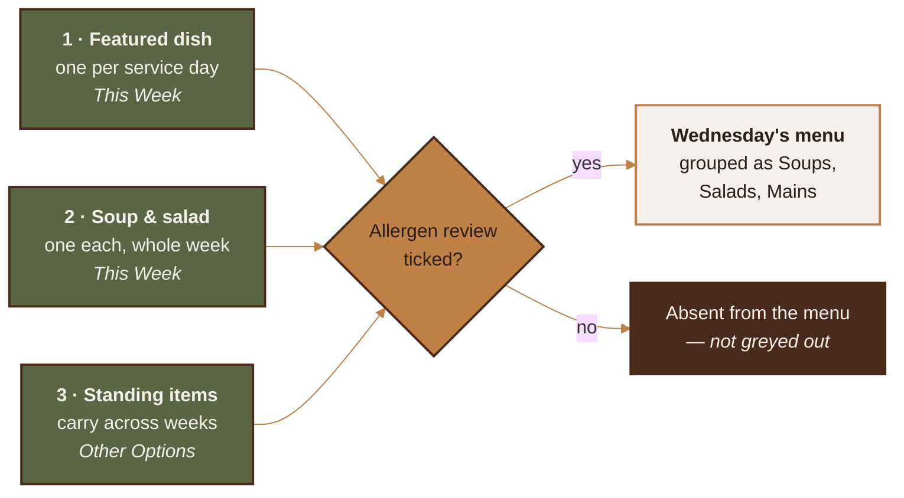
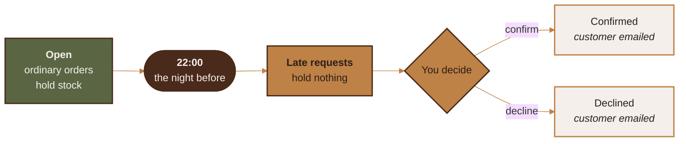

<p align="center">
  
</p>

<p align="center">
  
  
  
  
  
  
</p>

An installable web app for taking supper-club orders. Customers open a link,
pick a day, order, and choose pickup or delivery. You run the week from a phone.

There is no app store, no customer accounts, and no online payment. It is a
website that installs to a home screen and works like an app.

> [!TIP]
> **New here? Three commands and you're serving.** `npm install`, fill in
> `.env`, `npm start`. Everything else in this file is detail you can come
> back for.

---

## Contents

- 🔥 [Running it](#running-it)
- 🔑 [Environment variables](#environment-variables)
- 🍲 [The three-level menu](#the-three-level-menu)
- ⏰ [The cutoff](#the-cutoff)
- 🚪 [Pickup window and locations](#pickup-window-and-locations)
- 🚗 [Delivery area](#delivery-area)
- ⚠️ [Allergens](#allergens)
- 💵 [Payment instructions](#payment-instructions)
- 🎨 [Colours and the theme file](#colours-and-the-theme-file)
- 📱 [Icons](#icons)
- 📣 [Social graphics](#social-graphics)
- 💳 [Business card](#business-card)
- ✨ [README artwork](#readme-artwork)
- 👍 [Facebook](#facebook)
- 💾 [Backup and restore](#backup-and-restore)
- 🚀 [Deployment](#deployment)
- ✅ [Tests](#tests)
- 📦 [Dependencies](#dependencies)

---

## Running it

Node 20 or newer.

```bash
npm install
cp .env.example .env      # then fill it in — see below
npm run icons             # generates the app icons from brand/
npm start
```

The customer site is at `/`. Your dashboard is at `/admin`.

`npm run dev` restarts on file changes.

---

## Environment variables

Everything lives in `.env`. Copy `.env.example` and fill it in. Restart after
any change — nothing in this file is read again while the app is running.

| Variable | Required | What it does |
|---|---|---|
| `ADMIN_PASSWORD` | **Yes** | The password for `/admin`. There is no reset link; changing it means editing this file and restarting. |
| `SESSION_SECRET` | **Yes** | Signs your login cookie. Changing it signs you out everywhere, which is the fastest way to kill a session on a lost phone. |
| `PORT` | No | Defaults to 3000. |
| `BASE_URL` | Recommended | The public https address, no trailing slash. Used in emails, share links, the Facebook post, and the OAuth redirect. Must match exactly. |
| `DB_PATH` | No | SQLite file. Defaults to `./data/dinnerbyderek.db`. |
| `UPLOAD_DIR` | No | Photo storage. Defaults to `./data/uploads`. |
| `GRAPHICS_DIR` | No | Generated social graphics and business card. Defaults to `./data/graphics`. |
| `SMTP_*` | No | Order emails. Leave blank and orders are still saved and still appear in the dashboard — you just won't get an email. |
| `FB_APP_ID`, `FB_APP_SECRET` | No | Only for one-tap publishing to a Facebook Page. |
| `FB_GRAPH_VERSION` | No | Defaults to `v21.0`. |
| `TOKEN_ENCRYPTION_KEY` | If using Facebook | 64 hex characters. Encrypts the Facebook token before it touches the database. |
| `NODE_ENV` | On the server | Set to `production`. Turns on secure cookies and long-lived static caching. |

Generate a secret or a key:

```bash
node -e "console.log(require('crypto').randomBytes(32).toString('hex'))"
```

`DB_PATH`, `UPLOAD_DIR` and `GRAPHICS_DIR` must survive a redeploy. If your host
wipes the app directory on deploy, point all three at a persistent volume. The
graphics matter here because they are now made from a phone rather than from a
checkout — a redeploy that discards them takes the only copy with it.

---

## The three-level menu

This is the most important section. The menu has three levels, they are stored
separately, and they are only combined when a customer looks at a day.



### Level 1 — the featured dish

**One per service day.** A service day *is* a date plus its featured dish; that
is what makes the day worth showing up for.

Authored in **This Week**, one box per weekday — Monday through Sunday. Fill in
whichever days you're cooking and leave the rest blank. Each box is the same
full editor the soup and salad get: name, description, photo, halal flag,
allergen review, and both size variants with their own labels, prices and
counts. The "Week starts" date decides which seven calendar dates the boxes
point at — moving it only re-labels the boxes, it never touches a day you've
already filled in.

**Day details**, below, is not a second copy of that editor. It holds only the
things that belong to the date rather than the dish: a pickup-window override
for that one day, delivery on or off for it, and removing the day. Saving it
cannot overwrite what the box above holds.

#### How many you'll cook

Each day's featured dish has a ceiling, **25 by default**, set in
**Settings → How many of the featured dish**. Set it to `0` for no ceiling.

It counts **both sizes together** — one full size plus one meal for one uses
two of the 25. That is deliberate: it is a limit on portions leaving the
kitchen, not on either size separately.

A single day can be given its own number in its weekday box. Leave that blank
and the day uses the setting. The number carries over through *Duplicate last
week*.

This sits on top of the per-size counts, it does not replace them. Whichever
runs out first stops the orders. Customers see "Only N left for today" under
five, and a sold-out badge at zero.

**A late request never eats into it.** Past the cutoff a day takes requests
rather than orders, and a request holds nothing until you confirm it — so it
cannot sell out a dish ahead of a real order.

### Level 2 — soup and salad of the week

**One soup and one salad, for the whole week.** Not per day. By default they
appear Tuesday, Wednesday and Thursday, and you can change that per week. Either
one can be left blank.

Authored in **This Week**, in the two editors below the weekday boxes.

The database enforces the "one each" rule directly, so no amount of clicking can
produce two soups in a week.

### Level 3 — standing items

**Items that carry across weeks.** Ships with Chili, Pork Schnitzel, Breaded
Chicken Cutlets, Pulled Pork (Reheat Bag), BBQ Brisket (Reheat Bag) and Pulled
Chicken (Reheat Bag). These are not part of any week — building a new week
leaves them alone.

Authored in **Other Options**.

> [!WARNING]
> **Changes here go live immediately.** There is no draft state for standing
> items. Editing the price of Chili changes it on the live menu the moment you
> save. Orders already placed are not affected — they keep the price they were
> placed at.

### How they combine

A customer looking at Wednesday sees: Wednesday's featured dish, prominently;
then the week's soup and salad if they run on Wednesdays; then every standing
item. Grouped as Soups, Salads, Mains.

**Items you haven't finished reviewing are absent, not greyed out.** This is why
the seeded standing items don't appear on a fresh install: they have no
allergen review yet. Open **Other Options**, give each a description, review the
allergen suggestions, and tick the box. Then they appear.

Fulfillment is identical at all three levels: same pickup window, same locations,
same cutoff, same delivery rules. A standing item gets no exemption from the
cutoff.

---

## The cutoff

**22:00 local time on the calendar day before the service date.** Orders for
Monday close Sunday at 22:00.



Change the hour in **Settings**. The "day before" part is fixed and not
configurable — it is the rule the whole app is built around.

The timezone is also in Settings, defaulting to `America/Toronto`. The server's
own clock setting is never used, so the app behaves the same wherever it is
hosted.

Each day closes on its own. Monday closing does not affect Tuesday.

**After the cutoff a day does not vanish.** It switches to late-request mode.
Customers can still submit, clearly labelled as a request, and those land in
**Orders** pinned to the top with Confirm and Decline buttons. Confirming or
declining emails the customer. A pending late request holds no stock, so it can
never sell out a dish ahead of a real order.

Daylight saving is handled by doing the arithmetic on the calendar date rather
than by subtracting 24 hours. On the spring-forward weekend the gap between two
consecutive cutoffs is genuinely 23 hours, and the tests check this.

---

## Pickup window and locations

**Locations & Delivery.**

Set a start time and an end time — that's the whole window, like `4:00` to
`7:00 PM`. There's no time slot to book: a customer who orders for Wednesday
can walk in any time in that window, whenever suits them.

A single day can override the window from its card in This Week. The window
in effect when an order is placed is frozen onto that order, so changing the
window later never rewrites a pickup time someone already has.

Pickup locations are managed on the same page. The name and address are copied
onto each order when it is placed, so renaming a location later never rewrites
an old order.

---

## Delivery area

Eligibility is decided by **postal code**. You keep a list of allowed forward
sortation areas — the first three characters, like `N2L`.

Edit the list in **Locations & Delivery**. Adding or removing a code takes
effect immediately. **No redeploy, no code change, no developer.** The page also
shows how many orders have come from each area, so you can see which ones are
earning their place.

Seeded with the 15 Kitchener–Waterloo codes: N2A, N2B, N2C, N2E, N2G, N2H, N2J,
N2K, N2L, N2M, N2N, N2P, N2R, N2T, N2V.

Customers can type their postal code with or without a space, in any case, with
or without a dash — all forms are treated the same.

You can set one flat delivery fee, or per-zone fees if you group areas. A
delivery minimum is optional. Everything is recalculated on the server when the
order arrives, so a customer editing the page cannot give themselves free
delivery.

Distance-based delivery is deliberately **not** built. The code has a clean seam
for it (`server/delivery.js`), but adding it means a mapping service, an API key
and a bill, so it stays out until you actually want it.

---

## Allergens

> [!IMPORTANT]
> **The allergen tool makes suggestions. It does not make decisions. You do.**
> Nothing reaches a customer until you tick the review box, and editing a
> description takes the tick back off.

When you type a description, the app matches it against a dictionary of
ingredient words and suggests allergens. It reads "buttered mash" and suggests
milk. It does this by looking words up in a list — there is no AI involved, no
external service, and the same description always produces the same suggestions.

Each suggestion appears as a chip you **Accept** or **Dismiss**. You can add
tags by hand. Nothing is published until you tick:

> *I have reviewed the allergen information for this dish.*

Four rules protect that acknowledgement:

1. An item you haven't acknowledged never reaches a customer.
2. Suggestions left unanswered block publishing, even with the box ticked.
3. **Editing a description cancels the acknowledgement.** Adding "with a lemon
   butter sauce" to a reviewed dish makes it unreviewed again.
4. **Detecting nothing still requires acknowledgement.** An empty result means
   the word list found nothing, not that the dish is safe.

Publishing a week is blocked by name: *"Braised Beef still needs its allergen
review."*

The app never tells a customer a dish is allergen-free. Every menu page carries
the disclaimer that the food is made in a shared home kitchen where
cross-contamination is possible.

### Maintaining the dictionary

**Settings → Allergen dictionary.** Add a term, pick which allergen it suggests,
save. Remove terms that fire wrongly for your cooking.

It covers Health Canada's priority allergens, plus gluten as a separate tag —
because Health Canada treats gluten sources (barley, oats, rye, triticale,
wheat) as their own declarable category alongside wheat.

Matching handles plurals and past participles, so "cream" catches "creamed" and
"flour" catches "floured". It respects word boundaries, so "buttercup" does not
trigger butter. It leans toward suggesting too much rather than too little: a
wrong suggestion costs you one tap, a missed one reaches someone with an allergy.

The halal badge is worded as your own declaration, not a certification.

---

## Payment instructions

No money moves through this app. It takes orders; you get paid your own way.

Edit the wording in **Settings → Payment instructions**. It appears on the order
form and in the confirmation email. Say exactly what you want — cash at pickup,
e-transfer to a specific address, whatever it is.

---

## Colours and the theme file

Every colour is defined once, in `public/theme.css`, as a CSS custom property.

| | Name | Hex | Used for |
|---|---|---|---|
|  | Olive Green | `#5A6643` | Header and footer |
|  | Saddle Tan | `#BE8146` | Buttons, badges |
|  | Burnt Umber | `#4A2A1A` | Headings |
|  | Parchment | `#F4EFEB` | Backgrounds, cards |
|  | Espresso | `#2C1E18` | Body text |
|  | Warm Ochre | `#D8924A` | Button hover |

Eight more tones are derived from those six — never a new hue, always a step
lighter or darker. Six are surfaces and text that needed one; the last two
exist because the audit in `CONTRAST.md` found pairings that were not readable
enough, and the ratios they fixed are in the table:

| | Name | Hex | Why it exists |
|---|---|---|---|
|  | `--dbd-olive-deep` | `#414A2F` | Olive as body text on parchment |
|  | `--dbd-tan-deep` | `#8A5A2B` | Tan as body text on parchment |
|  | `--dbd-umber-soft` | `#6B4630` | Borders and muted labels |
|  | `--dbd-parchment-2` | `#EAE2DB` | Table stripes and wells |
|  | `--dbd-espresso-2` | `#1B120E` | Splash screen, print rules |
|  | `--dbd-cream-hi` | `#FBF8F6` | Card surfaces on wells |
|  | `--dbd-umber-deep` | `#3C2114` | Badge text: 3.92:1 → **4.52:1** |
|  | `--dbd-tan-lift` | `#EBC08C` | Active nav bar: 1.88:1 → **3.64:1** |

Changing a value there changes it everywhere — including the emails, the browser
theme colour, and the generated icons, which all read from this one file rather
than repeating the hex codes.

Saddle Tan on Olive scored 1.88:1 as an active-tab indicator, well under the
3:1 needed for a UI element, which is why `--dbd-tan-lift` exists at 3.64:1.
`CONTRAST.md` documents all of it.

After changing any colour:

```bash
npm run contrast
```

It checks every pairing the app ships and fails loudly if one drops below the
readable threshold. It is worth running: a colour that looks fine on a laptop
can be unreadable on a phone in a bright kitchen.

---

## Icons

Source artwork is in `brand/`:

- `logo-lineart.jpg` — the black line-art mark. **This is what the icons are
  built from.**
- `logo-medallion.jpg` — the leather version, used for the site header.
- `logo-wordmark.svg` — the full gold lockup, vector. **This is what the social
  graphics are built from**, because it is the only source that stays sharp at
  poster size.

To regenerate:

```bash
npm run icons
```

This reads `brand/logo-lineart.jpg` and writes `public/icons/`. **The originals
are only ever read, never modified.** To change the icon, replace the file in
`brand/` and run the command again.

The line art is used rather than the medallion because it is the higher
resolution of the two — the medallion's artwork is only about 206 pixels across,
so a 512-pixel icon made from it would look soft.

---

## Social graphics

**Dashboard → Graphics**, or from a terminal:

```bash
npm run social
```

Both run the same code. The page is the one that matters in practice — the
menu post is worth regenerating the moment a week goes live, and that happens
on a phone.

Writes five images to `GRAPHICS_DIR/social/`, all from `brand/logo-wordmark.svg`
and the colours in `theme.css`:

| File | Size | What it's for |
|---|---|---|
| `cover.png` | 1640×624 | Facebook page cover |
| `profile.png` | 1080×1080 | Profile picture |
| `menu.png` | 1080×1350 | The week's menu, as a feed post |
| `last-call.png` | 1080×1080 | Cutoff reminder the night before |
| `link-preview.png` | 1200×630 | What Facebook shows when the app link is pasted |

`menu.png` reads the **live database** — the published week, its dishes, prices
and pickup window. Publish the week first, then run this, and you get that
week's post rather than a blank template. With nothing published it falls back
to sample dishes so you can still see the layout.

`link-preview.png` is wired in as the default `og:image`, so pasting the app's
address into Facebook shows the branded card instead of a cropped app icon.

The lockup is knocked off its supplied charcoal background so it can sit on
olive and umber. That makes it **light artwork** — it needs a dark ground, and
will disappear on parchment.

The copies committed under `public/social/` are the fallback. The app serves
`GRAPHICS_DIR` first and falls back to those, so a fresh install has a link
preview before anything has been generated, and a wiped volume degrades to the
shipped artwork rather than to a broken image. The Graphics page labels which
of the two you are looking at.

Everything in both places is generated. Edit `scripts/social.js` or the theme,
never the PNGs.

---

## Business card

**Dashboard → Graphics**, or from a terminal:

```bash
npm run card
```

Writes two faces to `GRAPHICS_DIR/print/`, ready for a printer:

| File | What's on it |
|---|---|
| `card-front.png` | The gold lockup on olive, with one line saying what this is and where |
| `card-back.png` | The medallion, the pickup window, the delivery area, the cutoff, your contact line, and a QR that opens the site |

Both are **1126 × 676 pixels**: a 3.5 × 2 inch card at 300 DPI plus an eighth
of an inch of bleed on every side. The DPI is written into the file, so a print
shop opening it sees a 3.75-inch image rather than a 1126-pixel one. Ink that
has to survive the guillotine stays about a sixth of an inch inside the trim;
the olive ground and the hairlines run off the edge on purpose.

Front and back split identity from information. The lockup is light artwork —
it needs a dark ground and would disappear on parchment — and it already
contains the name, so the front sets nothing else in type. The back is
parchment, because a card that gets written on gets kept.

**The wording is not in this file.** The pickup window, the delivery area, the
cutoff hour, the business name and the contact line are read from the live
database, the same way `menu.png` is. Change the pickup window in Settings, run
this again, and the next card carries the new one. Colours come from
`theme.css`. Nothing is typed twice.

### The QR

> [!WARNING]
> It points at `BASE_URL`. **Set that in `.env` before printing.** Without it
> the code points at a placeholder — the command says so loudly, the Graphics
> page carries the same warning where you can't miss it, and the address is
> printed in readable type under the code, so a wrong one is visible on the
> card rather than hidden in it.

The code is drawn by `scripts/qr.js`, written here rather than installed:
byte mode, error correction level Q, versions 1 through 6, which is four times
the length any URL on a card will reach. Level Q survives about 25% of the
symbol being obscured, which is the right trade for something that lives in a
wallet. It is scaled by whole modules with nearest-neighbour so every module
edge lands on a pixel boundary — a resampled QR with soft edges is one a phone
in a dim hallway gives up on.

Version 7 and up need a version-information block that nothing here would
exercise, so rather than ship untested table data the encoder refuses and says
so. Every table row it does carry is checked against the version's total
codeword count at load, so a typo fails on `require` rather than at a print
shop.

Nothing ships in the repo for the card — unlike the link preview, no page needs
one to exist — so before the first generate the Graphics page shows both faces
as *Not generated yet*.

Everything here is generated. Edit `scripts/card.js` or the theme, never the
PNGs.

---

## README artwork

The banner at the top of this file, the badges under it, and the colour chips
in the table above:

```bash
npm run readme-art
```

Writes SVGs to `docs/`. **These are committed**, unlike the social graphics and
the card — GitHub renders this file straight out of the repository and cannot
run a script first.

The banner is animated: steam off the mark, a warm bloom behind it, and a shine
travelling along both hairlines. GitHub serves README images through a proxy
that strips scripts, so the motion is SMIL `<animate>` elements, which are
declarative and survive being loaded as an ``. The lockup is embedded as a
data URI in the same file, because a relative image reference inside an SVG
that is itself loaded as an image does not resolve on GitHub — link it and the
banner renders as an empty olive box.

No shields.io, no CDN, no webfont. The README of a codebase whose argument is
*no build step, no external service* should not need three network round-trips
to draw its own title, so the badges are made here from `theme.css` like
everything else. Both of their colour pairings are ones `CONTRAST.md` already
measures: Parchment on Olive at 5.38:1 for the label, Espresso on Saddle Tan at
4.91:1 for the value.

The two diagrams are Mermaid, which GitHub renders natively, coloured from the
same palette.

> [!NOTE]
> Section headings are deliberately plain — the emoji live in the Contents list
> instead. GitHub builds heading anchors from heading text, so an emoji in a
> heading would quietly change its anchor and break every link in that list.

---

## Facebook

### What is and isn't possible

**Publishing to a Facebook Group is not possible from any app.** Meta retired
the Groups API on 22 April 2024. This is not a limitation of this app and no
service can do it.

So Groups work like this: the app writes the post, you tap **Copy post text**,
and paste it into your group. Photos download with one tap. This path always
works and needs no setup at all.

**Pages** can be published to directly, if you set up a Meta app.

### Setting it up

1. Create an app at `developers.facebook.com` → **Business** type.
2. Add the **Facebook Login** product.
3. Set the redirect URI to exactly:

   ```
   https://your-domain.example/admin/facebook/callback
   ```

   It must match `BASE_URL` exactly — same scheme, same domain, no trailing
   slash. Mismatch is the most common cause of a failed connection.
4. Copy the App ID and App Secret into `.env`, add a `TOKEN_ENCRYPTION_KEY`,
   restart.
5. **Settings → Connect Facebook.**

### Scopes, and why each one

Three, which is the minimum that can publish to a Page:

| Scope | Why |
|---|---|
| `pages_show_list` | To list your Pages so you can pick one. Without it there is nothing to choose from. |
| `pages_read_engagement` | Required by Meta as a companion to the publishing scope; it is what lets the app read the Page it is posting as. |
| `pages_manage_posts` | To create the post. This is the one that does the actual work. |

Nothing broader is requested. No ads permissions, no insights, no messaging, no
`publish_to_groups` (which no longer exists).

### App Review

**Not needed**, as long as the only person authorising the app holds an admin,
developer or tester role on it. Meta allows apps to use permissions without
review when acting on behalf of someone with a role on the app itself. Since you
are the only person who will ever connect it, you qualify.

You would only need App Review if you gave this to other kitchens to run against
their own Pages.

### Tokens and reconnecting

The token is encrypted before it is stored and is left out of every backup.

Facebook tokens last about 60 days. The app emails you a warning seven days
before expiry, and marks the connection as needing attention in Settings if a
publish fails.

To reconnect: **Settings → Reconnect Facebook**. Same flow as the first time.
Nothing else is affected — reconnecting cannot disturb your menu or orders.

Publishing is never automatic and never scheduled. It happens when you tap the
button, having seen the preview.

---

## Backup and restore

**Settings → Backup.**

**Download a backup** gives you one JSON file containing every week, item,
order, location, delivery area and setting. Filenames are dated, so
`backup_2026-08-16_dinner-by-derek.json` is obvious a year later.

The Facebook token is **never** included. A backup file is safe to email
yourself or drop in cloud storage.

**Restore** replaces everything currently in the app with the contents of a
backup file. It asks you to type `RESTORE` first, because it is not undoable.
Take a fresh backup before restoring one.

Photos are files on disk, not part of the JSON — so a full backup is the JSON
file **plus** the `UPLOAD_DIR` folder.

There are also two CSV exports for spreadsheets: orders (with the source level
and pickup window in their own columns) and a contact list.

---

## Deployment

Behind nginx, with the app on port 3000:

```nginx
server {
  listen 443 ssl http2;
  server_name your-domain.example;

  ssl_certificate     /etc/letsencrypt/live/your-domain.example/fullchain.pem;
  ssl_certificate_key /etc/letsencrypt/live/your-domain.example/privkey.pem;

  client_max_body_size 30M;   # phone photos are large

  location / {
    proxy_pass         http://127.0.0.1:3000;
    proxy_http_version 1.1;
    proxy_set_header   Host              $host;
    proxy_set_header   X-Real-IP         $remote_addr;
    proxy_set_header   X-Forwarded-For   $proxy_add_x_forwarded_for;
    proxy_set_header   X-Forwarded-Proto $scheme;
  }
}

server {
  listen 80;
  server_name your-domain.example;
  return 301 https://$host$request_uri;
}
```

**https is required**, not optional. Without it the app cannot be installed to a
home screen, and the login cookie will not be secure.

Keep it running with systemd:

```ini
[Unit]
Description=Dinner By Derek
After=network.target

[Service]
Type=simple
User=dinnerbyderek
WorkingDirectory=/srv/dinner-by-derek
ExecStart=/usr/bin/node server/index.js
Restart=always
RestartSec=5
Environment=NODE_ENV=production

[Install]
WantedBy=multi-user.target
```

`client_max_body_size` matters: leave it at the nginx default of 1 MB and photo
uploads fail with an error that does not mention nginx, which is a miserable
thing to debug.

---

## Tests

```bash
npm test              # everything
npm run acceptance    # rules: cutoffs, postal codes, allergen gate
npm run flow          # a full session over HTTP
npm run contrast      # colour readability
```

`acceptance` checks the rules in isolation — that 21:59 the night before is open
and 22:01 is not, that a description edit cancels its acknowledgement, that a
Toronto postal code is refused.

`flow` starts the real server and drives it like a browser: sign in, build a
week, get blocked by the allergen gate, clear it, publish, order as a customer,
then try to cheat — a forged price, a nonexistent pickup location, a faked
delivery eligibility flag — and confirms each is refused.

Both run against a scratch database. Neither touches real orders.

Worth running before any deploy. The flow test has already caught a routing
fault that made CSV downloads answer with a login page instead of a 401.

---

## Dependencies

Deliberately few, and no build step. The source that ships is the source that
runs.

| Package | Why |
|---|---|
| `express` | HTTP server |
| `better-sqlite3` | The database — one file, no server to run |
| `sharp` | Photo resizing |
| `heic-convert` | iPhone photos |
| `nodemailer` | Order emails |
| `dotenv` | Reads `.env` |
| `cookie-parser` | Reads the login cookie |
| `multer` | Reads photo uploads |

> **Note for review:** `cookie-parser` and `multer` were added beyond the
> originally approved list. They are needed because the login cookie has to be
> parsed and photo uploads arrive as multipart form data — the approved stack
> had no way to read either. Both are small, long-established, and used only in
> `server/index.js`. Flagging them because adding dependencies was something to
> confirm rather than assume.

No front-end framework. No ORM. No bundler. Pages are HTML the server writes and
the browser renders.
